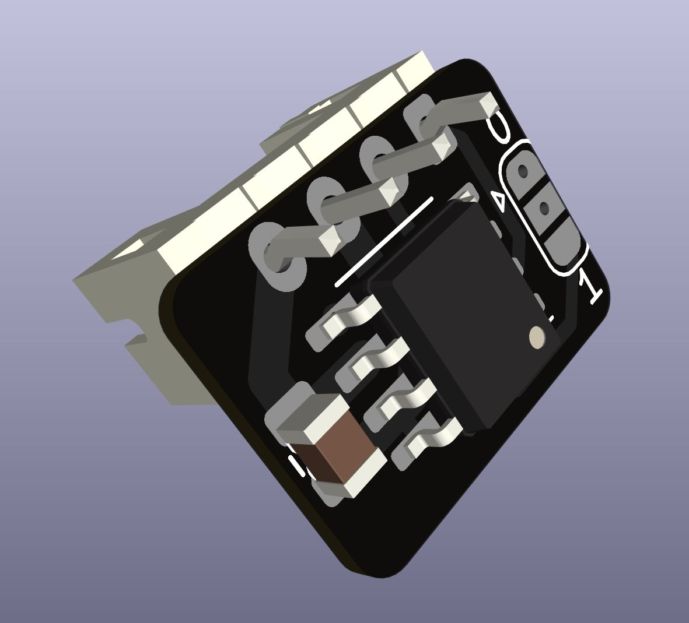

# Sensor PCB

## BOM
- 1x Sensor PCB
- 1x MLX90395 SOIC8 (Which sub-variant doesn't matter as the settings are set in software)
- 1x 0805 capacitor 22uf (the value is not that important)
- 1x JST PH 4pin through hole male socket

## PCB
ALFws_pcb.zip contains the manufacturing files for the pcb. At the time of writing this both jlcpcb and pcbway produce them quite cheaply.

**The pcb needs to be 0.8mm thick.** No fancy gold plating or anything required.

## Assembly
- Solder on the sensor and it's capacitor.
- Bridge one of the i2c address options (center to 0 or center to 1).
- Solder on the jst ph socket.
- Snip the legs of the jst ph socket to below the height of the sensor

Done.
