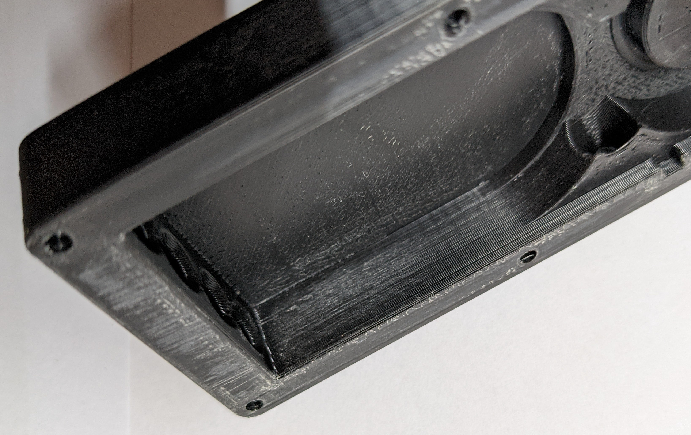

# ALFws (ActuallyLinearFilamentWidthSensor)


## Features
### Sensor
- Very good linearity over 1mm (centred on ~1.75)
- Good linearity over 2-3mm (3mm filament is theoretically compatable, but remains untested)
- No thermal drift on the sensor
- Low drag
### Software
- Filament width compensation (of course)
- Logging filament diameter
- Undersized or oversized filament protection
- Delayed runout

## Why would you want that?
I mainly started this project ages ago because my local filament manufacturer doesn't know what QC is and happily ships filament with more than +/- 0.25mm tolerances. This isn't my first attempt at a filament width sensor but it is by far my best. With this I can print massively undersized or oversized or perfectly sized filament without ever having to touch my extrusion multiplier.

## BOM
### Electronics
- 1x Sensor PCB
- 1x JST PH 4pin female cable
### Mechanical
- 2x 6804 ball bearing
- 2x 6x3mm OR 1x 6x6mm magnet (if you can, get SmCO ones, they have less thermal drift)
- 2x 5x15 coil spring, 0.6mm wire diameter OR 8x 6x3mm neodymium magnets, the cheap kind
- 8x m3x8 screws
### Tools
- Fine-ish sanding pad/sandpaper
- Pliers
- Sidecutters
- Hammer or some other heavy object to hit stuff with
- 1.5mm and 2mm drill bit or other cylindrical metal objects of known size in that range for calibration

## Printing
Unless you want to constantly recalibrate this thing you need to print it in ABS or some other option that doesn't creep (definitely not PLA or Nylon), also avoid fiber filled filaments. The files are designed to print in the orientation they come in and do not require supports.

For MainBody **IRONING IS REQUIRED** since it is pretty much impossible to sand the inside sliding surface well enough, for the rest except the lid it is just highly recommended.

Except for MainBody the parts **need to be printed on a smooth buildplate**.

Use at least 3 perimeters and 5 top and bottom layers.

# Build
This is kind of a precision instrument and the quality of the final result heavily depends on how well it was assembled. Unfortunately this involves sanding.

Pretend the two m3x6 screws on this picture are also m3x8

## Cleaning up MainBody
Make sure the walls of the sliding surface on the bottom and the sides are smooth and have nothing sticking out. In most cases this should be fine off the printer but in this one there was a little defect in the walls. Also make sure the top surface for the lid is smooth and flat.


## Assembling the plunger
Place the bearing on MainPlunger and place BearingTop on top of that.


Take a piece of the filament you printed with, sharpen the end, then push it through the pin hole. You may need to drill out the holes in BearingTop if the filament doesn't fit. Push them in most of the way, cut the filament a couple mm from the top, and hammer it in the rest of the way. Once it is all the way in snip it off as flush as you can.

Screw the bearing down using an m3x8 screw.

Do not use exessive force in the next step since SmCO magnets are quite fragile and chip easily. Place your SmCo magnets in the slot and gently press them all the way down. They should fit snuggly in place and sit a little bit below the surface of the part. **You may have to use glue if the magnets don't fit snugly**, we don't want wobbly magnets.


## Fitting the plunger
**Only sand with the sandpaper below the part** and avoid getting dust into the bearing, or it will seize and become crunchy. It is recommended to fix the sandpaper to a flat surface and move the part across the sandpaper. This avoids inadvertently making the part unlevel.

Sand the sides of the plunger until it slides smoothly. You don't want to sand too much otherwise you'll get side to side play.


*If you are using coil springs skip this step*

Push 2 magnets into each of the outer holes on the plunger, both facing in the same direction. The inner holes remain unused (could be used for more magnets if for some reason more spring force is required)

Sand down the top of the plunger (the bottom should already be smooth) until you can freely shake it around with the lid closed. Start by just holding the lid closed by hand (only grip at the corners) and then when that works screw in the 2 middle screws and check again. You want to remove as little as possible so you get smooth motion and not a lot of play.


# Note to chestwood: You'll likely have to fix this section as I don't know the hardware and am having to guess based on context clues. Instructions related to the sensor were missing.
## Preparing the sensor 
Solder the components to the PCB, paying attention to the orientation of the magnetometer.
It is recommended to use a capacitor value over x uF
Choose an I2C address, and bridge the corresponding pads. Pads 1 and 2, or pads 1 and 3  (0=12, 1=13)


## Putting it all together
*If you are using coil springs skip this step*

Put the other 2 stacks of magnets into the holes as shown. The plunger should be attracted to the back of the sensor body like in the second picture. The magnets should now work as springs.


Put the second bearing into MainBody, put BodyBearingHolder on top of it and screw it down. The bearing holder should not stick out the top, if it does sand it down.


*If you are using coil springs put the springs into the outer holes when putting in the plunger*

Place the plunger into the body. It's normal that the bearings don't completely touch when closed but they should get within less than 1mm.


## Putting the sensor in the lid
**While the sensor is still free, note what jumper value is set because you won't be able to see it later, and if none is set fix that**

Gently push the sensor board into the hole in the lid as shown.


Push a sharpened piece of ABS filament into the hole on the side of the lid, over the sensor and into the hole on the other side. Once you reach the entrance of the inner hole, cut the filament about 2mm from the side and hammer it the rest of the way in, it should be flush otherwise cut the rest off. Then repeat for the second hole.


## Putting on the lid
Make sure the sensor part is over the magnet in the plunger and close the lid using 6 m3x8 screws.


**Congratulation the sensor is built** 

Stick some filament in it, check if the bearings are running smoothy and the plunger closes up correctly once you pull it back out.

# Installation

## Wiring

**If you are somehow still on a platform with 5V IO pins you are going to need a level shifter for SDA and SCL. Examples include ATMEL based boards like ramps and the old creality boards. If in doubt measure the voltage on the SDA pin before connecting.**

Find an available I2C port on yur mainboard and connect the sensor to it. While you can theoretically use any pins with software I2C, I recommend using HW I2C since the sensor produces quite a bit of I2C traffic which would take up quite a lot of the MCUs computing power.

For example I use the I2C port on PB8 and PB9 on the octopus pro.


If you do not have any I2C pins available on your current board you could use a separate microcontroller like a Pi Pico, STM32 bluepill or anything else supported by Klipper.

Simply connect the pins on the sensor to the corresponding ones on your board (GND to GND, 3.3V to 3.3V, SDA to SDA and SCL to SCL).

Do your best to minimize the wire length as longer cables have more interference, which could cause failed transmissions. A single failed transmission will have Klipper shut down. Shutting down from a non-essential communication failure is a drawback of Klipper in its current code state.

## Mounting
While I do leave mounting as a bit of an exercise for the user I do supply a known working "reference design".

Ultimately you just need to put the sensor in the filament path but the exact mounting method makes quite a difference on the data it generates. For best results the filament path should be constrained for about 10-30cm before and after the sensor, as well as pushed slightly towards the fixed bearing on the sensor. Failing to constrain the filament path will not hinder operation, but it will add a ton of noise to the data. Confining the filament path is recommended for this reason. 


I have included STLs for a 0.5mm offset mount for the sensor and tube holders that fit into 6mm wide 2020 channels as a starting point. If you design a nice mount for yourself feel free to submit it as a pull request.

# Software
## Installing the software
Copy **filament_width_sensor_hall_mlx90395.py** and **filament_width_compensation.py** from the "Software" folder into your Klipper install under "klippy/extras/" and restart the Klipper service.

## Klipper configuration
Add the following section to your Klipper config:

```
[filament_width_sensor_hall_mlx90395 mlx1]
#I2C_mcu: sensorBoard
I2C_bus: I2C1a
I2C_speed: 400000
I2C_address: 12 # 12 if addr 0, 13 if add 1
cal_dia1: 1.5
cal_dia2: 2.0
raw_dia1: 32000
raw_dia2: -32000

[filament_width_compensation]
sensor: mlx1
compensation_enabled: false
runout_enabled: true
oversize_enabled: true
logging: true
default_nominal_filament_diameter: 1.75
poll_time: 0.1
measurement_interval: 1
measurement_delay: 1000
runout_delay: 0
use_current_dia_while_delay: false
max_difference:0.2
runout_diameter: 1.4
oversize_diameter: 1.9
pause_on_runout: true
```

Replace ```I2C_bus``` with the one you are actually using. You can look up the names on mainsail by going to "Machine" then clicking the name of the MCU. My case turned out to be I2C1a. If your sensor isn't on the main mcu you'll also need to set ```I2C_mcu``` accordingly.


Set ```measurement_delay``` to the distance between the center of the sensor and about the middle of the meltzone in mm.

At this point you can restart klipper and if everything went well it should start up fine.

If you are curious you should now find the unique ID of your sensor in the logs by searching for "MLX90395 with ID:". Not sure what to do with that information but if that log line is there it definitely connected.

Check if you can read the sensor using '''MLX_QUERY_RAW SENSOR=mlx1''', this should give you a raw reading of the sensor.

## Calibration
For calibration you'll need 2 reference pieces around the target size, I used 1.5mm and 2mm drill bits.

First measure your reference pieces, in my case the 1.5mm drill bit measures at 1.485mm and the 2mm one at 1.995mm. Enter those values as ```cal_dia1``` and ```cal_dia2``` in your sensor config (no need to restart yet).

Now gently put your first reference piece into the sensor, making sure it is nicely between the bearings and not getting caught somewhere else. Wiggle it around and push and pull a bit, then take a reading using ```MLX_QUERY_RAW SENSOR=mlx1 AVERAGING=100```, I got 30 for the 1.5mm sample. Note your value as ```raw_dia1```. Then repeat the whole thing for your second sample (in this case I got -15612) and note that in ```raw_dia2```.


Putting that all together my calibrated sensor now looks like this (just as an example, no value in copying any of that)
```
[filament_width_sensor_hall_mlx90395 mlx1]
I2C_bus: I2C1a
I2C_speed: 400000
I2C_address: 12 # 12 if addr 0, 13 if add 1
cal_dia1: 1.485
cal_dia2: 1.995
raw_dia1: 30
raw_dia2: -15612
```

## Verifying calibration
Check if your calibration worked by putting your reference sample back in and calling ```QUERY_FILAMENT_WIDTH```, if it worked you should get the diameter of your reference piece, repeat with the other one and some filament.

Make sure the sensor reads less than ```runout_diameter``` when empty. Adjust ```runout_diameter``` if necessary (though if the default value is too low, there may be assembly or calibration errors).

Set ```oversize_diameter``` to something below the thinnest diameter in your filament path. For a dragon I would not go above 1.9mm, other hotends my be able to take more.

# Using filament width compensation
So far you have a really fancy filament runout sensor that knows the diameter of the filament. Next comes the interesting part, actually using filament width compensation.

You can activate it by setting ```compensation_enabled``` to true or temporarily enable or disable compensation using the ```ENABLE_FILAMENT_WIDTH_COMPENSATION``` and ```DISABLE_FILAMENT_WIDTH_COMPENSATION``` commands.

With filament width compensation you need to recalibrate your extrusion multiplier for your filaments. Keep in mind you must need to extruder at least ```measurement_delay``` before calibration actually kicks in, so don't try calibrating before that.

After that you should not have to worry about the actual diameter of your filament anymore.

**Important: always clear the filament array after loading filament**

You can clear the array using the ```CLEAR_FILAMENT_ARRAY```. If you don't do that it'll compensate on wrong data and may actually make things worse.

If you have a filament loading macro it may make sense to add it to that.

# Config options
## [filament_width_sensor_hall_mlx90395]
```
[filament_width_sensor_hall_mlx90395 my_sensor]
#I2C_mcu:
#   The name of the micro-controller that the chip is connected to.
#   The default is "mcu".
#I2C_bus:
#   If the micro-controller supports multiple I2C busses then one may
#   specify the micro-controller bus name here. The default depends on
#   the type of micro-controller.
#I2C_speed:
#   The I2C speed (in Hz) to use when communicating with the device.
#   The Klipper implementation on most micro-controllers is hard-coded
#   to 100000 and changing this value has no effect. The default is
#   100000. Linux, RP2040 and ATmega support 400000.
#I2C_address:
#   The I2C address of the device. This must specified as a decimal
#   number (not in hex). The default is 12.#
#   12 if addr 0, 13 if add 1
#cal_dia1:
#cal_dia2:
#   The calibration values (in mm) for the sensors. The default is
#   1.50 for cal_dia1 and 2.00 for cal_dia2.
#raw_dia1:
#raw_dia2:
#   The raw calibration values for the sensors. The default is 10000
#   for raw_dia1 and -10000 for raw_dia2.
```
## [filament_width_compensation]
```
[filament_width_compensation]
sensor:
#   Name of the filament width sensor
#compensation_enabled:
#   Compensation enabled or disabled after power on. The default is to
#   disable.
#runout_enabled:
#   Runout enabled or disabled after power on. The default is to
#   disable.
#oversize_enabled:
#   Oversize runout enabled or disabled after power on. The default is to
#   disable.
#logging:
#   Filament width logging enabled or disabled after power on. The default is to
#   disable.
#default_nominal_filament_diameter:
#   The nominal filament diameter (what the "correct filament width is assumed to be").
#   needs to be provided and >1
#poll_time: 0.1
#   How long to wait between taking readings in seconds default is 1
#measurement_interval: 1
#   The minimum distance between readings in the compensation buffer
#measurement_delay: 1000
#   The distance from sensor to the meltzone in
#   millimeters (mm). The FIFO buffer keeps each sensor value and
#   position in an array and POP them back in correct position. This
#   parameter must be provided.
#runout_delay: 0
#   How much before the meltzone (based on measurement delay) it should stop on runout in mm. 
#   For example 200 would mean stop 200mm in front of the meltzone, keep in mind after the runout
#   is triggered it doesn't stop instantly so leave enough extra.
#   The default is 0 (disable delayed runout entirely and stop right at the sensor)
#use_current_dia_while_delay:
#   If the compensation should use the first reading it got while the buffer catches up (after power up
#   or buffer clear). Otherwise it will use default_nominal_filament_diameter.
#   The default is false
#max_difference:
#   Maximum allowed filament diameter difference in millimeters (mm).
#   If difference between nominal filament diameter and sensor output
#   is more than +- max_difference, extrusion multiplier is set back
#   to %100. The default is 0.200.
#runout_diameter:
#   Diameter below which a runout is triggered (if runout is enabled)
#   The default is 1.0
#oversize_diameter: 1.9
#   Diameter above which a runout is triggered (if oversize is enabled)
#   The default is 1.9
#pause_on_runout: True
#   When set to True, a PAUSE will execute immediately after a runout
#   is detected. Note that if pause_on_runout is False and the
#   runout_gcode is omitted then runout detection is disabled. Default
#   is True.
#runout_gcode:
#   A list of G-Code commands to execute after a filament runout is
#   detected. See docs/Command_Templates.md for G-Code format. If
#   pause_on_runout is set to True this G-Code will run after the
#   PAUSE is complete. The default is not to run any G-Code commands.
#insert_gcode:
#   A list of G-Code commands to execute after a filament insert is
#   detected. See docs/Command_Templates.md for G-Code format. The
#   default is not to run any G-Code commands, which disables insert
#   detection.
```
# Commands
## [filament_width_sensor_hall_mlx90395]
### MLX_QUERY_RAW
```MLX_QUERY_RAW SENSOR=<sensor> AVERAGING=<count>``` Allows requesting a raw reading from the specified sensor with optional averaging.

## [filament_width_compensation]
### QUERY_FILAMENT_WIDTH
```QUERY_FILAMENT_WIDTH``` requests a reading for the current sensor and displays it.
### DUMP_FILAMENT_ARRAY
```DUMP_FILAMENT_ARRAY``` dumps the current content of the filament width buffer to the console
### CLEAR_FILAMENT_ARRAY
```CLEAR_FILAMENT_ARRAY``` clears the filament width buffer
### ENABLE_FILAMENT_WIDTH_COMPENSATION
```ENABLE_FILAMENT_WIDTH_COMPENSATION``` Temporarily enables filament width compensation
### DISABLE_FILAMENT_WIDTH_COMPENSATION
```DISABLE_FILAMENT_WIDTH_COMPENSATION``` Temporarily disables filament width compensation
### ENABLE_FILAMENT_WIDTH_RUNOUT
```ENABLE_FILAMENT_WIDTH_RUNOUT``` Temporarily enables filament width runout
### DISABLE_FILAMENT_WIDTH_RUNOUT
```DISABLE_FILAMENT_WIDTH_RUNOUT``` Temporarily disables filament width runout
### ENABLE_FILAMENT_WIDTH_OVERSIZE
```ENABLE_FILAMENT_WIDTH_OVERSIZE``` Temporarily enables filament oversize runout
### DISABLE_FILAMENT_WIDTH_OVERSIZE
```DISABLE_FILAMENT_WIDTH_OVERSIZE``` Temporarily disables filament oversize runout
### ENABLE_FILAMENT_WIDTH_LOGGING
```ENABLE_FILAMENT_WIDTH_LOGGING``` Temporarily enables filament width logging
### DISABLE_FILAMENT_WIDTH_LOGGING
```DISABLE_FILAMENT_WIDTH_LOGGING``` Temporarily disables filament width logging
### SET_FILAMENT_WIDTH_OVERSIZE_DIAMETER
```SET_FILAMENT_WIDTH_OVERSIZE_DIAMETER OVERSIZE_DIAMETER=<dia>``` Temporarily sets the oversize diameter
### SET_FILAMENT_WIDTH_RUNOUT_DIAMETER
```SET_FILAMENT_WIDTH_RUNOUT_DIAMETER RUNOUT_DIAMETER=<dia>``` Temporarily sets the runout diameter

# FAQ
## What is wrong with other sensors?
Other sensors' readings drifted as the ambient temperature changed. Having a filament compensation independant of the room temperature was important to me. Other sensors that claimed to cancel thermal drift by using 2 analog sensors in opposite directions didn't actually test their claims. I therefore had to test these claims which took me down this rabbit hole. I found that any two given analog sensors do not drift exactly the same, or even in the same direction. The geometry of the opposing sensors didn't have the sensors centered with respect to the magnet and so the distane from one sensor to the magnet was different than from the other sensor, meaning they couldn't actually cancel each other. In my testing I found that such an arrangment just gets you a pretty ugly curve that warps into another ugly curve over temperature. Such sensors did not compensate 1:1 throughout the range of filament diameters either (ie they were non-linear). I'm not sure of the precise extent of the harm of a non-linear sensor, but I want this sensor to remove variables not add new ones. I may have gone a bit overboard.

## Why use such an obscure sensor instead of the abundant and cheap analog ones the other sensors use?
Turns out that there are thermally compensated hall sensors calibrated by the manufacturer that exist in both digial and analog form, and they were pretty much the same price. I tested both and liked the digital one better. Their configurability made testing easier and it had a better ADC than all the 3D printer MCUs I know of that is also closer to the sensor.

## Why use such big bearings?
The difficult part of the design was turning filament width into linear displacement. The tension and natural bend of filament can cause it to bow away from the fixed side and appear too large. This can be mitigated by using more force but then you start to squish the filament which introduces a whole other non-linear source of error, as well as causing extreme drag. Small bearings had less drag but squished the filament too much. Confining the filament path helped a lot with the tension and bend of filament skewing results which significantly reduced the required spring force. This also allowed me to go back to more reasonably sized bearings. With the current version there should be negligible squish.

## Why are there 4 spots for springs and we only use 2?
That leaves the option open to use more force. Though no longer necessary the option doesn't hurt.

## Why is the magnet facing forward?
That is the correct way of doing it, as shown in an [application note](https://www.ti.com/lit/an/slya051a/slya051a.pdf?ts=1712645532232&ref_url=https%253A%252F%252Fwww.google.com%252F) by TI which was pretty much a brute force mapping out by hand the readings with respect to distance. (I can't find who sent the application note to me but still thank you). 

# Potential future improvements
I am looking into integrating it with a high resolution filament motion sensor as position data source instead of the motion system.

Other than that I have been using it as it is now for over a year and very similar earlier versions even longer than that.

# Special thanks
- **Deuterious** for the nice blog post proving filament width compensation can be practical
- **Whoever sent me the TI pdf** for making magnets make a bit more sense
- **MiracuruZRH** for testing
- **My glorious local filament manufacturer** for creating the reason to make this and providing extreme samples
